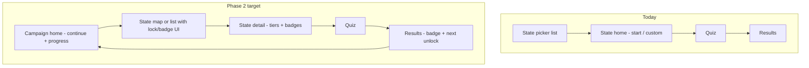

# State Cities — Product Blueprint

> **North star:** A progression-based U.S. city mastery game where players unlock, learn, and conquer the map one state, region, and challenge tier at a time.

This document maps the vision in `cities_game_project_context.md` to the current codebase and defines a phased plan to get there without overbuilding.

---

## 1. Where we are today

### What already works (strong foundation)

| Area | Status | Key files |
| --- | --- | --- |
| Map quiz core | Done | `StateMap.tsx`, `useQuiz.ts`, `QuizScreen.tsx` |
| 50 states + map data | Done | `registry.ts`, `public/maps/*`, `src/data/states/*.json` |
| Tap → feedback → score | Done | hints after 2 misses, wrong-name teaching, haptics |
| Zoom / pan / declustered dots | Done | `StateMap.tsx`, `geo.ts` |
| Custom city subset quiz | Done | `CustomQuizScreen.tsx`, `activeCityIds` |
| PWA (offline after first load) | Done | `manifest.json`, `public/sw.js` |
| Config-driven data pipeline | Done | `build-state-data.ts`, `build-physical-data.ts` |
| City tier metadata in data | Partial | `tier: 1 \| 2` on each city — **not exposed as playable tiers** |

### Phase 1 gaps (finish before mastery layer)

| Gap | Impact |
| --- | --- |
| Best score is Oregon-only | Breaks replay motivation across states |
| No permanent URL / deploy | Can't share or retain users outside dev tunnel |
| Flat state list UI | Doesn't feel like a campaign or mastery journey |
| Results screen is minimal | No badge, no “what's next”, weak completion moment |
| No “continue” / home hub | Player always starts at raw state picker |

**Assessment:** We are at **~90% of Phase 1** (core playable quiz). The app is a capable Seterra-style tool, not yet a progression game.

---

## 2. Target experience (playable as described)

A new player should feel this loop within the first session:

```
Pick a starter state → play a tier quiz → see score + badge progress →
unlock the next state or tier → come back tomorrow to improve
```

Long-term, the same loop scales up:

```
State tiers → state mastery badges → region unlock → regional quiz →
national challenges → expert modes
```

### Emotional hook to optimize for

> “I am slowly conquering the U.S. map.”

Every screen and feature should support **mastery visibility** and **clear next action**.

---

## 3. Core systems to introduce (architecture)

Build these once, early in Phase 2 — they underpin everything after.

### 3.1 Player progress store

Single source of truth for all persisted player state.

```ts
// Conceptual shape — implement in src/progress/
interface PlayerProgress {
  version: number;
  bestScores: Record<QuizKey, number>;     // e.g. "OR:major" → 92
  mastery: Record<QuizKey, MasteryBadge>;  // none | bronze | silver | gold | diamond
  unlockedStates: string[];                // USPS codes
  unlockedTiers: Record<string, TierId[]>; // per state
  stats: { quizzesPlayed: number; citiesSeen: number; /* … */ };
  weakCities: Record<string, number>;      // cityId → miss count (Phase 6)
  xp: number;
  level: number;
  streak: { current: number; lastPlayedDate: string };
}
```

- **Storage:** `localStorage` first (matches current pattern); schema version + migration helper.
- **QuizKey:** `{scope}:{tier}:{mode?}` — e.g. `WA:major`, `NE:expanded`, `MW:region`, `US:top100`.
- **Hook:** `usePlayerProgress()` — read/update, derived helpers (`getMastery`, `recordQuizResult`).

### 3.2 Quiz session config

Decouple “what quiz is running” from navigation state in `App.tsx`.

```ts
interface QuizSession {
  scope: { type: "state" | "region" | "national"; id: string };
  tier: TierId;
  mode: "standard" | "no-dots" | "timed";  // expert later
  cities: CityMeta[];                       // resolved at start
}
```

`useQuiz` and `ScoreBoard` consume `QuizSession` + `QuizResult` → `recordQuizResult(session, result)`.

### 3.3 Tier definitions (data, not UI magic)

Start with **derived tiers** from existing city lists — no new Census fetch required for v1 tiers.

| Tier ID | Label | City rule (v1) |
| --- | --- | --- |
| `major` | Major Cities | `tier === 1` only (~8–12 cities/state) |
| `standard` | Full State | all curated cities (current default) |
| `expanded` | Expanded | *Phase 2b+* — top 25 via registry expansion |
| `deep` | Deep Cut | *Phase 2b+* — top 50 |
| `expert` | Expert / No dots | same cities, different `mode` |

Helper: `getCitiesForTier(stateMeta, tierId)`.

### 3.4 Mastery rules

| Badge | Threshold | Unlocks |
| --- | --- | --- |
| Bronze | ≥ 70% accuracy | Counts as “mastered” for progression |
| Silver | ≥ 85% | Cosmetic + stats |
| Gold | 100% | Completionist satisfaction |
| Diamond | 100% in expert/timed | Later |

Store **best** accuracy per `QuizKey`; upgrade badge when threshold crossed.

### 3.5 Region config

New file: `src/data/regions.ts`

```ts
interface Region {
  id: string;           // e.g. "pacific-northwest"
  name: string;
  states: string[];     // USPS codes
  unlockRule: { type: "statesMastered"; count: number }; // e.g. 3 bronze in region
}
```

Regional quiz = load multiple state city GeoJSON layers OR a prebuilt regional map (decision in Phase 4).

---

## 4. Screen map — current → target



| Screen | Today | Target |
| --- | --- | --- |
| Home | None (starts at picker) | Continue last quiz, streak, XP bar |
| State selection | Flat list, all unlocked | Starter states free; locks + badges visible |
| State detail | Single “Start quiz” | Tier cards with best score + badge each |
| Quiz | Same | Same (+ tier/mode label in header) |
| Results | % + Oregon best | Badge earned/upgraded, retry missed, next unlock hint |
| Region | — | Region progress + mixed quiz entry |
| National | — | Challenge list (Top 100, etc.) |
| Stats / profile | — | Per-state history, weak cities (Phase 6) |
| Store | — | Phase 6+ only |

---

## 5. Phased roadmap

Each phase has a **shippable milestone** — something you can playtest on a phone and share via URL.

### Phase 1 — Finish core playable quiz ✅ → ship

**Goal:** Anyone can play any state on a real URL and trust their scores.

| # | Deliverable | Effort |
| --- | --- | --- |
| 1.1 | Per-state + per-session best scores (`ScoreBoard` → progress store) | S |
| 1.2 | Deploy `dist/` to Vercel/Netlify (permanent HTTPS link) | S |
| 1.3 | Results polish: clearer copy, “Back to state” vs “All states” | S |
| 1.4 | Optional: rename/branding pass toward “conquer the map” tone | S |

AGENTS.md should mention progress store

**Exit criteria:** Play any state via public URL; full-quiz best score persists per state.

**Status:** Done (deploy when ready to share).

---

### Phase 2 — State mastery (highest ROI next)

**Goal:** Answer “why replay tomorrow?” with tiers + badges + visible progress.

This is the **smallest progression layer** that matches the vision doc's strategic priority.

| # | Deliverable | Effort |
| --- | --- | --- |
| 2.1 | `PlayerProgress` store + migrations | M |
| 2.2 | `QuizSession` + wire through `App.tsx` | M |
| 2.3 | Tier resolver: `major` (tier-1 only) + `standard` (all cities) | S |
| 2.4 | State detail screen: tier cards, best %, badge icons | M |
| 2.5 | Mastery evaluation on quiz complete (bronze/silver/gold) | S |
| 2.6 | Results screen: badge earned, upgrade animation, retry missed cities | M |
| 2.7 | State picker: show badge summary per state (e.g. 🥉 or “2/2 tiers”) | M |

**Exit criteria:** Player completes WA Major at 72%, earns Bronze, sees it on state detail, replays for Silver.

**Status:** Done.

**Data note:** Major tier = top 10 cities by population from each state's curated list. Phase 2b adds expanded/deep tiers with more registry cities.

---

### Phase 2b — Expanded city depth (optional parallel track)

**Goal:** More replay depth per state without changing app architecture.

| # | Deliverable | Effort |
| --- | --- | --- |
| 2b.1 | Registry + build pipeline supports 25 / 50 cities per state | L |
| 2b.2 | Add `expanded` and `deep` tier definitions | S |
| 2b.3 | Spot-check dense states (CA, TX, FL) for dot clutter | M |

**Exit criteria:** California Expanded (25) is playable with acceptable UX.

---

### Phase 3 — Campaign hub + regional progression (in progress)

**Goal:** Always open to a hub that guides the next step; chunk the country by region.

| # | Deliverable | Status |
| --- | --- | --- |
| 3.1 | Campaign hub (default screen): Continue, points, level, store placeholder | Done |
| 3.2 | `getNextRecommendation()` — tier ladder + regional steering | Done |
| 3.3 | Browse states **grouped by 7 regions** | Done |
| 3.4 | New player: choose a state or random state | Done |
| 3.5 | Results → Continue journey + Home | Done |
| 3.6 | Points + level on quiz complete | Done |
| 3.7 | Daily regional focus card → playable daily challenge | Done |
| 3.8 | Locked states / mastery-gated unlocks | Not started |
| 3.9 | Region mini-map on hub + region detail screen | Done |

**Regions (7):** Northeast, Southeast, Midwest, Southwest, Mountain West, West Coast, Pacific (AK/HI).

**Design decisions locked:**
- App **always** opens to the hub (never the flat state list).
- No forced home-state picker; **choose a state** or **random state** for new players.
- Daily challenges will be **regional** (rotate by day), not a random national mix.
- Store row reserved on hub; currency spends come in Phase 6.

**Exit criteria:** Returning player sees Continue on hub; new player sees pick/random; browse lists states by region; completing a quiz updates points and steers the next recommendation.

---

### Phase 3 (original unlock items — deferred)

### Phase 4 — Region system

**Goal:** Mixed-state quizzes and regional badges.

| # | Deliverable | Status |
| --- | --- | --- |
| 4.1 | Region progress screen + hub mini-map | Done |
| 4.2 | Unlock: N states at bronze in region → regional quiz | Done |
| 4.3 | Regional map component (multi-state bounds + projection) | Done |
| 4.4 | Regional quiz + regional mastery badges | Done |
| 4.5 | Regional tap + type modes; Journey entry points | Done |

**Exit criteria:** Unlock a region quiz after 3 states at bronze; play mixed map; scores persist per region.

---

### Phase 5 — National challenges

**Goal:** Endgame “boss levels.”

| # | Deliverable | Effort |
| --- | --- | --- |
| 5.1 | National city pool (Top 100 / 250) — curated list + coordinates | Done (Top 100 from state data) |
| 5.2 | US-wide map view (us-atlas) with city dots | Done (50-state composite map) |
| 5.3 | Challenge modes + national badges | Done (tap + type) |
| 5.4 | Unlock gate: e.g. 30 states bronze → Top 100 | Done |

**Exit criteria:** Top 100 challenge playable on US map; badge at 85%+.

---

### Phase 6 — Retention + monetization readiness

**Goal:** Habit loops and optional revenue — **only after Phases 2–3 feel fun.**

| # | Deliverable | Effort |
| --- | --- | --- |
| 6.1 | Daily challenge (seeded city set, shared score) | Done |
| 6.2 | Streaks + weekly goal | Done |
| 6.3 | Weak city practice (from miss tracking) | Done |
| 6.4 | Stats / profile screen | M |
| 6.5 | Shareable result card (image or link) | M |
| 6.6 | Expert modes: no-dot, timed | M |
| 6.7 | Store skeleton: unlock-all, region skip (no ads first) | M |
| 6.8 | Rewarded ads for currency (optional, opt-in) | M |

**Monetization principle:** Free players progress through mastery; payment accelerates only.

---

### Phase 7 — Leaderboards & rankings *(deferred — reminder only)*

**Goal:** Competitive and comparative progress — **not on the near-term roadmap.** Capture here so timed modes, dailies, and campaign depth have a clear endgame for social/ranked play.

| # | Deliverable | Notes |
| --- | --- | --- |
| 7.1 | **Daily challenge leaderboard** | Same UTC seed worldwide → comparable scores; needs backend or shared leaderboard service |
| 7.2 | **Timed / speed challenge rankings** | Per-quiz and per-tier best times; pairs with Phase 6.6 timed mode |
| 7.3 | **Total progress rank** | Campaign-wide standing: points, badges, states mastered, regions cleared — “where am I vs everyone?” |
| 7.4 | **Regional / national leaderboards** | Optional scoped boards (e.g. West Coast regional quiz, Top 100 national) |
| 7.5 | **Friends or opt-in compare** | Lightweight “beat my score” links before full accounts |

**Prerequisites:** Timed mode (6.6), stable quiz keys, likely **account sync or anonymous leaderboard IDs** — localStorage-only is insufficient for real rankings.

**Design note:** Rankings should complement mastery (not replace it). Personal best + badge wall stay primary; leaderboards are optional motivation for players who want competition.

---

## 6. Recommended build order (next 4 milestones)

These are the concrete sequences to implement in the repo:

### Milestone A — Ship Phase 1 (1–2 days)

1. `src/progress/` with `PlayerProgress` v1 (best scores only)
2. Fix `ScoreBoard` to use `QuizKey` = `{usps}:standard`
3. Deploy to Vercel
4. Smoke test on mobile

### Milestone B — Tiers + badges (3–5 days)

1. `getCitiesForTier()` + tier picker on state detail (replace bare `HomeScreen`)
2. Mastery thresholds + badge UI on results
3. Badge summary on state list
4. “Retry missed cities” button on results (reuses `result.missed`)

### Milestone C — Campaign home + unlocks (3–5 days)

1. Campaign home as new default screen
2. Starter states + unlock rules
3. XP/level (simple)
4. Locked state UI

### Milestone D — First region (1–2 weeks)

1. One pilot region (e.g. Pacific Northwest: WA, OR, ID)
2. Regional map spike + quiz
3. Region badge

Defer national challenges, store, ads, and 50-city tiers until B+C feel sticky in playtesting.

---

## 7. What we reuse vs what we build new

### Reuse (don't rewrite)

- `StateMap.tsx` — works for any `activeCityIds` subset
- `useQuiz.ts` — scoring/hints/missed cities already correct
- `registry.ts` + build scripts — extend for more cities per state
- `tier: 1 | 2` on cities — becomes Major tier filter immediately
- PWA shell — offline play supports retention later

### Build new

- `src/progress/*` — persistence layer
- `src/data/tiers.ts` — tier definitions
- `src/data/regions.ts` — region groupings
- `StateDetailScreen` — replaces minimal `HomeScreen`
- `CampaignHomeScreen` — new entry point
- `RegionalMap.tsx` / `NationalMap.tsx` — Phase 4–5
- Router (optional): consider `react-router` once screen count grows; manual `Screen` union in `App.tsx` is fine through Phase 3

---

## 8. Open decisions (resolve before Phase 3)

| Decision | Options | Recommendation |
| --- | --- | --- |
| Starter states | Fixed 3 vs player picks home state vs geo-IP | **Player picks 1 home state + 2 random** — emotional hook |
| Unlock graph | Linear 50-state order vs regional adjacency | **Regional adjacency** — matches vision |
| Major tier size | Strict tier-1 only vs top-N by population | **tier-1 flag** now; switch to top-10 by pop in 2b |
| All states free initially? | Yes vs gated | **All free until Phase 3** — validate mastery loop first, then gate |
| Backend | localStorage only vs sync | **localStorage through Phase 5**; add account sync when daily/streaks matter |

---

## 9. Success metrics (playtesting)

Track informally at first (localStorage analytics blob):

- **D1 retention:** Did they play again the next day?
- **Replay rate:** Quizzes per state before moving on
- **Major → Standard conversion:** Do players graduate tiers?
- **Missed city retry:** Do they use “practice missed”?
- **Session length:** Target 2–8 minutes

---

## 10. Decision rules (from vision doc)

Before building any feature, ask:

1. Does this make the game more fun or replayable?
2. Does this help the player feel mastery?
3. Does this support state, region, or national progression?
4. Is it understandable in under 10 seconds?
5. Does it preserve monetization optionality without feeling cheap?

If no to all → defer.

---

## 11. Summary

| Phase | Player-facing outcome | Status |
| --- | --- | --- |
| 1 | Play any state, good quiz feel, public URL | **Done** — deploy `dist/` when ready |
| 2 | Tiers, badges, replay for mastery | **Done** |
| 3 | Campaign hub, regions, guided next step | **Done** (3.8 state locks deferred) |
| 4 | Regional quizzes (tap + type) | **Done** |
| 5 | National Top 100 boss challenge | **Done** |
| 6 | Retention + monetization | Partial (streaks, weak cities, daily) |
| 7 | Leaderboards & rankings (daily, timed, total progress) | **Deferred** — reminder in blueprint |

**The line from here to “playable as described” runs through Phase 3**, not Phase 6. Phases 1→2→3 deliver the mastery progression fantasy; everything after amplifies it. Phase 7 (leaderboards, timed rankings, total progress rank) is intentionally **later** — see §5 Phase 7.

---

## 12. App Store readiness

Capacitor scaffold, app icons, privacy page, and Capacitor-safe asset loading are
in place. **Do not submit until Phase 2–3 UI is stable** — screenshots and listing
copy should match the shipped game.

See **`docs/APP_STORE.md`** for commands, privacy posture, and the pre-submission checklist.

---

*Generated from codebase audit + `cities_game_project_context.md`. Update this doc when phase exit criteria are met.*
